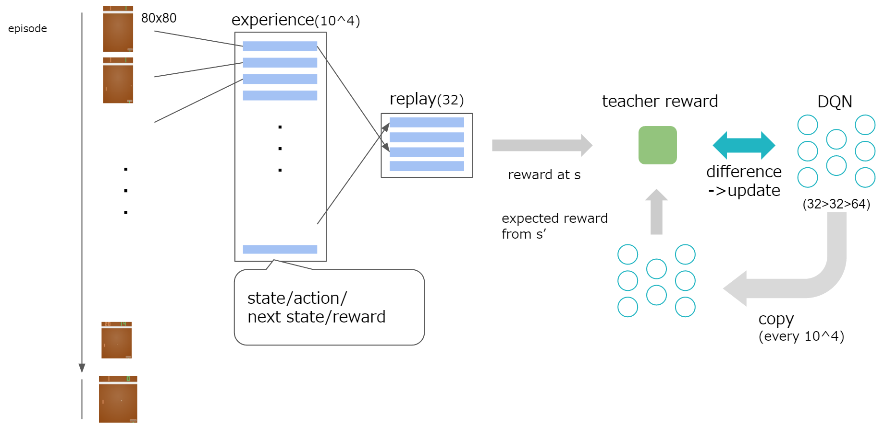

# chainer pong

DQN implementation by Chainer.

## Model Overview




Dependencies

* Chainer(>=1.15)
* gym(>=0.2.11)


## Run

```
python run.py
```

It iterators 5 episode. If you store the model on `./store` directory, that is loaded.  
You can use trained model that are located in `trained_model` directory (it is stored by [Git LFS](https://git-lfs.github.com/), storing latest 5 model). 
Please copy it to `/store` directory then run script.

If you want to submit the result, set the option `--submit <your api key>`.

Below is the result by latest trained model.

[OpenAI Gym/icoxfog417 algorithm](https://gym.openai.com/evaluations/eval_V4ZjiW90Tyh1WRZQEGSQ)


## Train

```
python run.py --train
```

If you use GPU, add `--gpu` option.
The trained model is stored in `./store` directory. If you want to change the parameters, please modify `run.py`.
The training parameters is manged in [`DQNTrainer`](https://github.com/icoxfog417/chainer_pong/blob/master/model/dqn_trainer.py).
